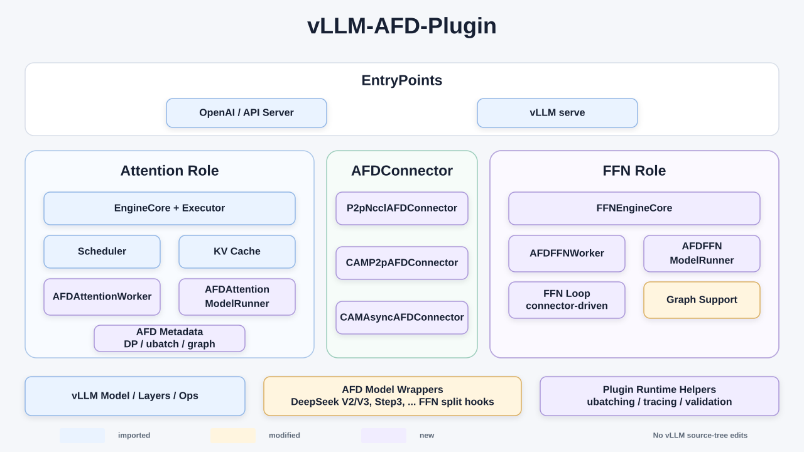

# afd-plugin

## Overview

**afd-plugin** is a [vLLM](https://github.com/vllm-project/vllm)
external plugin for **Attention-FFN Disaggregation (AFD)**. It provides
plugin-owned worker classes, model runners, model wrappers, connectors,
configuration validation, compatibility shims, and hardware-gated integration
tests for GPU and Ascend NPU deployments.

> [!NOTE]
> This project is still experimental and needs more large-scale testing across
> different hardware backends.

The target runtime is **vLLM `v0.19.1`**. The plugin does not modify the vLLM
source tree. AFD behavior is installed through the `vllm.general_plugins` entry
point, explicit `--worker-cls` class paths, `--additional-config`, plugin-owned
model wrappers, and narrow version-scoped compatibility shims.

## Architecture



## Current Status

Core runtime support:

- vLLM plugin registration, AFD configuration, and runtime validation.
- Attention/FFN workers, model runners, model wrappers, and connector-driven
  execution for CUDA and Ascend NPU.
- Eager and `FULL_DECODE_ONLY` graph execution, plus backend-specific profiling
  support.

Model support:

| Model family | Registered architectures | Notes |
| --- | --- | --- |
| DeepSeekV2 / DeepSeekV3 | `DeepseekForCausalLM`, `DeepseekV2ForCausalLM`, `DeepseekV3ForCausalLM` | Uses `afd_plugin.model_executor.models.deepseek_v2` wrappers. Attention and FFN sides currently load full model weights. |

Connector support:

See the [recipe index](recipe/README.md) for deployment and benchmark examples.

| Connector | Platform | Recommend Stage | Sync or Async | Graph Support | Notes |
| --- | --- | --- | --- | --- | --- |
| `P2pNcclAFDConnector` | CUDA | Decode | Sync | `FULL_DECODE_ONLY` CUDA graph | FFN ranks are ordered before Attention ranks. `num_attention_ranks` must be greater than or equal to `num_ffn_ranks` and divisible by it. See the [DeepSeek V2 Lite recipe](recipe/gpu/P2pNcclAFDConnector/deepseek_v2_lite/README.md). |
| `CAMP2pAFDConnector` | Ascend NPU | Decode | Sync | `FULL_DECODE_ONLY` ACL graph | Uses HCCL/CAMP2P custom ops. Ascend ops build by default on NPU platforms. See the [synchronous DeepSeek V3.2 recipe](recipe/npu/CAMP2pAFDConnector/deepseek_v3_2/README.md). |
| `CAMAsyncAFDConnector` | Ascend NPU | Prefill | Async | Not supported | Uses CAM async-DP custom ops and requires `async=true` with the Ascend NPU workers. See the [asynchronous DeepSeek V3.2 recipe](recipe/npu/CAMAsyncAFDConnector/deepseek_v3_2/README.md). |

Connector implementations are grouped by backend package:
`afd_plugin.connectors.gpu` for GPU-only connectors,
`afd_plugin.connectors.npu` for NPU-only connectors.

Known gaps:

- vLLM versions other than `0.19.1` are not claimed as supported.
- vLLM/vLLM-Ascend model runner v2 is not supported.
- GPU and NPU E2E tests are opt-in and require real hardware plus model weights.
- GPU CUDA graph support is limited to `FULL_DECODE_ONLY`.
- GPU DBO plus CUDA graph is limited to exactly two ubatches.

## Install

Requires Python **3.10-3.13** and [uv](https://docs.astral.sh/uv/).

```bash
git clone https://github.com/vllm-project/afd-plugin.git
cd afd-plugin
uv sync --group dev
```

`vllm` is an optional runtime extra so CPU-only or macOS development
environments can still run import/config tests without a CUDA wheel:

```bash
# Linux / CUDA-capable environments
uv sync --group dev --extra vllm
```

The optional extra pins `vllm==0.19.1`.

## Using the Plugin

Install or sync the distribution as `vllm-afd-plugin`. Python imports and CLI
class paths use the `afd_plugin` package name.

AFD is configured through vLLM `--additional-config`. There is no separate
`--afd-config` flag.

GPU Attention-side shape:

```bash
vllm serve /path/to/DeepSeek-V2-Lite \
  --worker-cls afd_plugin.v1.worker.AFDAttentionWorker \
  --served-model-name deepseek-v2-lite-afd-attention \
  --data-parallel-size 1 \
  --tensor-parallel-size 1 \
  --enable-expert-parallel \
  --enforce-eager \
  --host 127.0.0.1 \
  --port 18000 \
  --additional-config '{"afd":{"enabled":true,"role":"attention","connector":"P2pNcclAFDConnector","host":"127.0.0.1","port":6239,"num_attention_ranks":1,"num_ffn_ranks":1}}'
```

GPU FFN-side shape:

```bash
vllm serve /path/to/DeepSeek-V2-Lite \
  --worker-cls afd_plugin.v1.worker.AFDFFNWorker \
  --served-model-name deepseek-v2-lite-afd-ffn \
  --data-parallel-size 1 \
  --tensor-parallel-size 1 \
  --enable-expert-parallel \
  --enforce-eager \
  --host 127.0.0.1 \
  --port 18001 \
  --additional-config '{"afd":{"enabled":true,"role":"ffn","connector":"P2pNcclAFDConnector","host":"127.0.0.1","port":6239,"num_attention_ranks":1,"num_ffn_ranks":1}}'
```

NPU uses the same config channel with Ascend class paths and
`CAMP2pAFDConnector`:

```bash
vllm serve /path/to/DeepSeek-V2-Lite \
  --worker-cls afd_plugin.v1.worker.ascend.AFDNPUAttentionWorker \
  --served-model-name deepseek-v2-lite-afd-attention \
  --data-parallel-size 1 \
  --tensor-parallel-size 1 \
  --enable-expert-parallel \
  --enforce-eager \
  --host 127.0.0.1 \
  --port 18000 \
  --additional-config '{"afd":{"enabled":true,"role":"attention","connector":"CAMP2pAFDConnector","host":"127.0.0.1","port":6239,"num_attention_ranks":1,"num_ffn_ranks":1}}'
```

Start the FFN side first, then start the Attention side and send requests to
the Attention API server. FFN workers are connector-driven; scheduler-driven
FFN `execute_model()` calls fail fast.

For repeatable local smoke testing, prefer the bundled runner:

```bash
uv run python tests/e2e/runner.py \
  --model /path/to/DeepSeek-V2-Lite \
  --device-backend gpu \
  --num-attention-ranks 1 \
  --num-ffn-ranks 1 \
  --attention-gpus 0 \
  --ffn-gpus 1 \
  --api-port-base 18000 \
  --afd-port 6239 \
  --common-vllm-arg=--trust-remote-code
```

For NPU, use `--device-backend npu`; the runner maps the same device arguments
to `ASCEND_RT_VISIBLE_DEVICES` and selects `CAMP2pAFDConnector`.

## AFD Config

The canonical config shape is:

```json
{
  "afd": {
    "enabled": true,
    "role": "attention",
    "connector": "P2pNcclAFDConnector",
    "host": "127.0.0.1",
    "port": 1239,
    "num_attention_ranks": 2,
    "num_ffn_ranks": 1,
    "afd_role_rank": 0,
    "compute_gate_on_attention": false,
    "extra_config": {}
  }
}
```

`role` must be `attention` or `ffn`. `connector` must be `P2pNcclAFDConnector`,
`CAMP2pAFDConnector`, or `CAMAsyncAFDConnector`. The plugin also accepts selected
compatibility aliases such as `afd_role`, `afd_connector`, `afd_host`,
`afd_port`, and `afd_extra_config`.

## Development

Run the default CPU-safe checks:

```bash
uv run pytest
uv run ruff check .
```

Native C/C++ sources are grouped by backend under `csrc/`: Ascend/CANN sources
live in `csrc/npu`, including the `a2e` and `e2a` ACLNN operators, and
`csrc/gpu` is reserved for GPU native sources.

Ascend custom ops are built automatically only when the build environment looks
like an Ascend NPU platform, for example when `torch_npu`, CANN environment
variables, or the default Ascend toolkit path are present. GPU builds skip
Ascend ops by default. Set `AFD_BUILD_ASCEND_OPS=1` or
`AFD_BUILD_ASCEND_OPS=0` to override the auto-detection.

## E2E Test

To run E2E tests, use the [`run-e2e` skill](.agents/skills/run-e2e/SKILL.md).

## Docs

- [docs/gpu/ATTENTION_RUNTIME_DESIGN.md](docs/gpu/ATTENTION_RUNTIME_DESIGN.md)
  - GPU Attention worker and model-runner design.
- [docs/gpu/FFN_RUNTIME_DESIGN.md](docs/gpu/FFN_RUNTIME_DESIGN.md) - GPU FFN
  worker, daemon loop, and connector-driven execution design.
- [docs/npu/NPU_ATTENTION_RUNTIME_DESIGN.md](docs/npu/NPU_ATTENTION_RUNTIME_DESIGN.md)
  - Ascend NPU Attention worker and model-runner design.
- [docs/npu/NPU_FFN_RUNTIME_DESIGN.md](docs/npu/NPU_FFN_RUNTIME_DESIGN.md) -
  Ascend NPU FFN worker, daemon loop, CAMP2P, and ACL graph design.

## License

afd-plugin is licensed under the [Apache License 2.0](LICENSE).

## Cite

If you find afd-plugin helpful in your research or projects, please
consider citing it:

```bibtex
@misc{afdplugin2026,
  title={afd-plugin: Attention-FFN Disaggregation for vLLM},
  author={AFD Plugin Contributors},
  year={2026},
  howpublished={\url{https://github.com/vllm-project/afd-plugin}},
}
```
