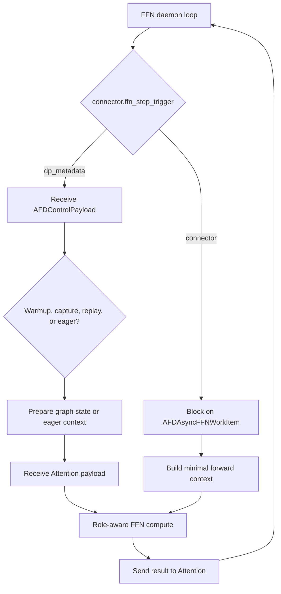

# FFN runtime

## Purpose and boundary

This document is the primary design for connector-driven FFN lifecycle
orchestration: daemon startup, empty KV-cache behavior, scheduler rejection,
compute handoff, error propagation, and shutdown. Transport semantics belong
to [connector contracts](connector_contracts.md); CUDA/Ascend graph, stream,
profiler, native-op, and build mechanisms belong to
[execution platforms](execution_platforms.md).

## Ownership and dependency direction

FFN consumes plugin configuration, connector transport, model-side compute,
platform mechanisms, and EngineCore compatibility. No shared module may depend
on the FFN worker or runner implementation.

## Runtime selection

FFN is launched as a `vllm serve` process with an explicit role-specific
worker, but it does not serve requests. Attention and FFN may be started in
either order. Send API traffic only to Attention.

| Platform | Worker | Model runner | Current connectors |
| --- | --- | --- | --- |
| CUDA | `afd_plugin.v1.worker.AFDFFNWorker` | `GPUFFNModelRunner` | `P2pNcclAFDConnector` |
| NPU | `afd_plugin.v1.worker.npu.AFDNPUFFNWorker` | `AFDNPUFFNModelRunner` | `CAMP2pAFDConnector`, `CAMAsyncAFDConnector` |

CUDA launch shape:

```bash
vllm serve <model> \
  --worker-cls afd_plugin.v1.worker.AFDFFNWorker \
  --additional-config '{"afd":{"role":"ffn","connector":"P2pNcclAFDConnector","host":"127.0.0.1","port":1239,"num_attention_ranks":1,"num_ffn_ranks":1}}'
```

Ascend launch shape:

```bash
VLLM_PLUGINS=ascend,afd vllm serve <model> \
  --worker-cls afd_plugin.v1.worker.npu.AFDNPUFFNWorker \
  --additional-config '{"afd":{"role":"ffn","connector":"CAMP2pAFDConnector","host":"127.0.0.1","port":1239,"num_attention_ranks":1,"num_ffn_ranks":1}}'
```

## Initialization and empty KV cache

The common FFN initialization sequence is:

```text
vLLM worker construction
  -> validate AFD config, role, connector, and explicit worker class
  -> reject model runner v2 and unsupported feature combinations
  -> initialize the matching upstream device worker
  -> construct the AFD FFN model runner
  -> derive the role-local AFD rank from DP/TP ranks when needed
  -> load the role-aware FFN model
  -> initialize an empty KV-cache surface
  -> initialize the connector
  -> start the background FFN loop
```

FFN does not own request KV blocks. Both workers return an empty KV-cache spec,
and both runners no-op KV-cache initialization. `compile_or_warm_up_model()`
returns `0.0`; warmup and graph capture, when supported, are driven later by
connector metadata. The EngineCore compatibility patch keeps FFN daemon mode
out of upstream scheduler/KV-cache startup assumptions and selects the daemon
busy loop. See [compatibility and patches](compatibility_and_patches.md).

The worker owns the daemon thread, shutdown event, and captured loop error.
The model runner owns the model, connector, profiler, and graph cache. The
connector owns transport/process-group resources.

## Daemon trigger modes

Connectors select one of two FFN triggers through their runtime capability:

| Trigger | Connectors | Worker behavior |
| --- | --- | --- |
| `dp_metadata` | `P2pNcclAFDConnector`, `CAMP2pAFDConnector` | Receive `AFDControlPayload`, then warm, capture, replay, or execute its stage map. |
| `connector` | `CAMAsyncAFDConnector` | Block directly on a connector work item; no separate DP-metadata control plane. |



### DP-metadata-triggered loop

```text
FFN initialize_from_config(...)
  -> initialize empty KV-cache surface
  -> initialize connector
  -> start daemon thread

daemon thread:
  -> recv_dp_metadata_list()
  -> inspect stage metadata plus warmup/capture flags
  -> capture/warm matching graph, or execute FFN forward
  -> synchronize the current accelerator
  -> repeat
```

### Connector-triggered loop

The Ascend worker checks `connector.ffn_step_trigger`. For CAM async it calls
`execute_connector_driven_step()` instead of `recv_dp_metadata_list()`. The
runner receives an `AFDAsyncFFNWorkItem` containing hidden states, transfer
payload, layer index, and token count, constructs a minimal forward context,
computes that layer, sends the output through the work-item API, and repeats.
CAM async is eager-only and does not use the FFN graph-control path.

## DP-metadata-triggered forward

The current runner contract for one control payload is:

1. Update connector state from the stage-indexed DP metadata.
2. Build the minimal vLLM forward context required by model-side MoE compute.
3. Iterate model layers and sorted stage ids.
4. Receive an `AFDA2FTransferPayload` for the current layer/stage.
5. Install stage DP metadata and transfer metadata at
   `ForwardContext.additional_kwargs["afd_metadata"]`.
6. Set vLLM's current MoE layer index when the upstream context exposes the
   layer list.
7. Compute FFN output and send it to Attention with the same layer/stage
   identity.

On CUDA, `GPUFFNModelRunner` is a plugin-owned minimal runner. It invokes
`model.compute_ffn_output(hidden_states, layer_idx)` when provided and
otherwise passes hidden states through; production AFD model paths are
expected to provide the compute method. On Ascend,
`AFDNPUFFNModelRunner` directly calls the role-aware model and passes the
available CAMP2P/CAM routing fields, including group lists, scales, top-k
values, router logits, row indices, active masks, and CAM endpoint data.

Ascend translates AFD-level token counts to the DP-level token-count vector
expected by the upstream forward context. When TP expands Attention rank
counts beyond DP metadata width, token counts are replicated per TP rank and
then aggregated for each FFN rank.

## Role-aware model loading

The FFN process uses vLLM's model loader, while plugin-owned model integration
constructs FFN MLP/expert components plus shared components needed by the
upstream lifecycle, without Attention modules. FFN runners do not sample
tokens. GPU LoRA mutation methods return unsupported/no-op results; the NPU
runner rejects sampling explicitly.

Detailed model construction and weight ownership remain in
[model integration](model_integration.md).

## Graph dispatch contract

For DP-metadata-triggered connectors, the graph cache key is derived from each
stage's token counts. Ascend also includes A/F topology when it must aggregate
Attention counts to FFN counts. The shared dispatch states are eager, warmup,
capture, and replay:

- warmup runs FFN compute after applying control state;
- capture applies connector control state before entering the formal device
  graph so control-plane work is not replayed;
- replay runs an existing graph for the matching key;
- a missing graph falls back to eager execution.

The Attention control payload is the source of warmup/capture flags. Device
graph objects, pools, supported modes, and exact cache behavior are specified
by [execution platforms](execution_platforms.md).

## Failure propagation and shutdown

`execute_model()` on either worker raises immediately if the native scheduler
tries to drive FFN work. The runner also rejects a normal execution call that
lacks its connector metadata/work item.

The daemon catches failures, stores the original exception, logs it, and makes
the error visible through `raise_ffn_loop_error_if_any()`. Re-entering startup
or completing shutdown therefore surfaces an earlier background failure.

Shutdown ordering is:

```text
signal daemon event
  -> runner stops profiler and closes connector
  -> join daemon thread with a bounded timeout
  -> surface stored loop error
  -> delegate remaining worker/runner shutdown upstream
```

Connector receive calls may be blocking; the connector's `close()` behavior
is responsible for releasing its communication resources so shutdown can
complete.

## Candidate invariants

The following RFC candidate remains non-normative while this document is
draft:

- `ROLE-INV-001` (FFN part): FFN remains connector-driven and rejects
  scheduler execution.

Mandatory control-plane methods and the current transfer payload shape are not
stable contracts.

## Upstream relationship and validation requirements

Changes must be compared with the pinned vLLM worker and EngineCore behavior
and, for Ascend, with the tested runtime evidence. Run the FFN runner,
EngineCore patch, NPU runtime, and serving tests listed in the metadata.
Trigger-capability or work-item changes also require connector and CAM async
model E2E coverage.

## Limitations and open issues

Current shared limits are the supported vLLM release, model runner v1,
connector-driven FFN only, and role-aware DeepSeek model integration. Native
DBO accepts exactly two ubatches. CAM async instead uses eager connector work
items and may enable its distinct two-stage MoE pipeline. Platform-specific
limits are centralized in
[execution platforms](execution_platforms.md#tested-runtime-matrix).

Connector metadata ownership, transfer state separation, and optional
control-plane capability remain open in
[#88](https://github.com/JiusiServe/afd-plugin/issues/88),
[#105](https://github.com/JiusiServe/afd-plugin/issues/105), and
[#107](https://github.com/JiusiServe/afd-plugin/issues/107).
