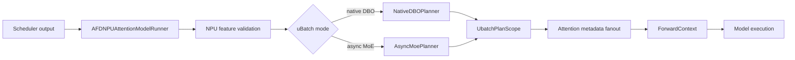

# NPU uBatch ModelRunner 重构与升级计划

## 1. 决策摘要

本次重构先在当前固定版本完成，再升级 vLLM-Ascend：

- vLLM：`v0.19.1`
- vLLM-Ascend：`v0.19.1rc1`
- AFD 支持：native DBO uBatch、async MoE request-boundary uBatch
- AFD 不支持：NPU prefill context parallel（PCP）
- 上游约束：不修改 vLLM 和 vLLM-Ascend

当 `prefill_context_parallel_size > 1` 时，AFD NPU runtime 必须直接报错。不能
静默退化，也不能保留一条未验证的半支持路径。

## 2. 目标

重构的主要目标不是改变算法，而是缩小 AFD 与上游 ModelRunner 的差异面：

1. AFD runner 只负责调用稳定的扩展点和组织 AFD 组件。
2. uBatch 决策通过显式 plan 传递，不依赖模块级可变状态。
3. native DBO 和 async MoE 使用不同 planner，但共享 plan、scope 和 metadata
   fanout 基础设施。
4. 与 `v0.19.1rc1` 强耦合的复制代码集中在一个版本目录。
5. 每次升级通过 contract snapshot 和小范围 diff 重新应用 AFD patch。
6. 删除 PCP 状态事务、stage metadata 和 debug 恢复逻辑，降低升级面。

非目标：

- 不修改 vLLM 或 vLLM-Ascend。
- 不在本轮重新设计上游的 DBO 或 graph 机制。
- 不承诺 NPU PCP 兼容性。
- 不把连接器中通用的 rank 计算能力一起删除。

## 3. 重构后的结构

```text
afd_plugin/
├── compat/npu/
│   ├── feature_validation.py
│   └── v0191rc1/
│       ├── model_runner.py
│       ├── attention_metadata_fanout.py
│       └── dp_coordination.py
└── v1/worker/npu/
    ├── attention_model_runner.py
    ├── ubatch_plan.py
    ├── ubatch_utils.py
    ├── async_moe_ubatch.py
    ├── attention_metadata_adapter.py
    ├── forward_context.py
    └── graph_capture.py
```

职责边界：

| 组件 | 职责 | 升级频率 |
| --- | --- | --- |
| `attention_model_runner.py` | 组合 AFD runner、选择稳定入口 | 低 |
| `ubatch_plan.py` | plan、scope、native/async planner | 低 |
| `async_moe_ubatch.py` | async MoE request-boundary split 与 sidecar | 中 |
| `attention_metadata_adapter.py` | AFD metadata 与上游 metadata 的适配 | 中 |
| `forward_context.py` | 将 plan/metadata 安装到 forward context | 中 |
| `graph_capture.py` | graph capture 的 AFD 扩展 | 中 |
| `compat/npu/v0191rc1/model_runner.py` | 复制的版本相关上游方法和 AFD patch | 高 |
| `attention_metadata_fanout.py` | 多 stage metadata 构建 | 高 |
| `dp_coordination.py` | DP token 协调 | 高 |
| `feature_validation.py` | 能力边界和失败策略 | 低 |

`v0191rc1` 不是额外的业务抽象层。它是升级隔离层：所有依赖该 tag 的上游签名、
字段和方法体集中放置。升级时新建或替换版本目录，稳定的 AFD planner 和 runner
组件尽量不变。

## 4. 核心对象

### 4.1 `UbatchPlan`

`UbatchPlan` 是一次 ModelRunner 调用的不可变执行描述：

```python
@dataclass(frozen=True)
class UbatchPlan:
    mode: UbatchMode
    should_ubatch: bool
    num_tokens_unpadded: int
    num_tokens_padded: int
    uniform_decode: bool
    ubatch_slices: UBatchSlices | None
    padded_ubatch_slices: UBatchSlices | None
    num_tokens_across_dp: torch.Tensor | None
    cudagraph_mode: CUDAGraphMode
```

支持的 mode 只有：

- `NONE`
- `NATIVE_DBO`
- `ASYNC_MOE`

### 4.2 `UbatchPlanScope`

`UbatchPlanScope` 将 plan 绑定到单次 runner 调用，退出时无条件清理。它解决三个
问题：

- 异常路径不会把 plan 泄漏到下一个 batch；
- nested helper 可以读取同一 plan；
- native DBO 与 async MoE 不能在同一 scope 中同时激活。

### 4.3 `NativeDBOPlanner`

输入是上游已计算的数据：

- 未 padding token 数；
- uniform decode 判定；
- DP coordination 结果；
- batch descriptor；
- graph mode。

输出是 `UbatchPlan`。planner 不持有 stream、graph 或 metadata builder。

### 4.4 `AsyncMoePlanner`

async MoE planner 只按 request 边界产生固定数量的 uBatch slice。它不包含 PCP
rank、PCP metadata 或 `PCPManager` 状态。

如果请求数不足以形成合法切分，返回 `NONE` plan。

## 5. 数据流



能力验证发生在运行路径之前：

```text
prefill_context_parallel_size > 1
    -> RuntimeError("AFD NPU runtime does not support PCP")
```

## 6. 分阶段实施

### Phase 0：冻结基线

状态：完成。

- 固定 vLLM `v0.19.1` 和 vLLM-Ascend `v0.19.1rc1` contract。
- 建立 no-uBatch、native DBO、async MoE uBatch 的单元测试基线。
- 增加结构测试，防止新代码继续向大 runner 堆积。
- 明确 PCP 不在支持矩阵中。

退出条件：

- contract snapshot 可重复生成；
- CPU 单测覆盖 plan 决策、清理和 metadata fanout；
- NPU E2E 命令可独立运行。

### Phase 1：建立薄 runner

状态：完成。

- runner 通过继承和组合复用上游。
- AFD 特有逻辑移动到独立模块。
- 上游大方法只在版本 compat 中保留必要副本。
- patch 函数标记 AFD 差异和来源。

退出条件：

- 稳定 runner 不再承载 DP coordination、graph capture 和 metadata fanout 主体；
- 版本相关代码可由单一目录审阅。

### Phase 2：隔离控制面与 forward context

状态：完成。

- AFD control-plane 与 NPU 执行扩展使用不同命名和职责。
- plan/metadata 通过 forward context 显式传递。
- 不引入模块级可变状态。

退出条件：

- 一次执行结束后无跨 batch 状态；
- 控制面不依赖 ACL graph 或版本 compat 的内部对象。

### Phase 3：统一 uBatch plan

状态：完成。

- 引入 `UbatchMode`、`UbatchPlan`、`UbatchPlanScope`。
- 引入 `NativeDBOPlanner`、`AsyncMoePlanner`。
- 两种 mode 强制互斥。

退出条件：

- planner 可用纯 CPU fixture 验证；
- 成功和异常路径都清理 scope；
- async MoE 命名中不再包含 PCP。

### Phase 4：metadata fanout

状态：完成。

- common metadata 只构建一次。
- 各 uBatch stage 只构建必须变化的 metadata。
- fanout 被隔离到版本 compat。

退出条件：

- no-uBatch 与 native/async uBatch shape 一致；
- stage metadata 不共享可变 alias；
- builder 抛异常时 scope 正常恢复。

### Phase 5：删除 PCP 适配

状态：完成。

- 删除 PCP stage metadata adapter。
- 删除 `PCPManager` snapshot/restore 和缓存。
- 删除 PCP debug 中承载的生产逻辑。
- 删除 PCP contract、单测和 E2E 参数。
- 增加 NPU runtime 显式拒绝。

退出条件：

- 生产目录中不存在 `pcp_stage.py` 或 `pcp_debug.py`；
- async MoE 只依赖 request-boundary slice；
- `prefill_context_parallel_size > 1` 有负向测试。

### Phase 6：graph capture 收敛

状态：完成。

- graph capture 入口独立。
- capture 使用同一 plan/forward-context 协议。
- graph 与 eager 的 mode 选择一致。

退出条件：

- graph helper 不复制整段 runner；
- graph 状态异常时可清理；
- eager 和 graph 的 plan contract 一致。

### Phase 7：升级护栏

状态：完成。

- contract snapshot 检查上游类、方法签名和关键 schema。
- 结构测试限制 compat 文件集合和稳定 runner 职责。
- CI 执行 Phase 0 至 Phase 7 的 CPU 测试。
- NPU E2E 覆盖 native DBO 和 async MoE uBatch。

退出条件：

- 当前 tag 上全量单测通过；
- frozen contract 与生成结果一致；
- 不存在 PCP 生产适配残留。

## 7. 当前测试矩阵

| 场景 | CPU 单测 | NPU E2E | 预期 |
| --- | --- | --- | --- |
| no-uBatch | 是 | 是 | 上游普通路径 |
| native DBO eager | 是 | 是 | threshold 决定是否切分 |
| native DBO graph | 是 | 是 | 使用 padded slices |
| async MoE uBatch | 是 | 是 | request-boundary slices |
| native 与 async 同时激活 | 是 | 否 | 明确失败 |
| PCP size > 1 | 是 | 否 | 明确失败 |
| speculative/hybrid 不支持组合 | 是 | 按需 | 明确失败 |

## 8. 升级到 vLLM-Ascend main 的流程

1. 记录新目标 commit/tag，不直接在旧 compat 上堆条件分支。
2. 重新生成新上游 contract，并比较：
   - `NPUModelRunner` 基类和 MRO；
   - 被 patch 的方法签名；
   - attention metadata schema；
   - graph/DP helper 的导入位置。
3. 从新版本复制需要 patch 的上游函数。
4. 只重新应用 `PATCH START/END` 中的 AFD 差异。
5. 先让 no-uBatch 路径通过，再验证 native DBO，最后验证 async MoE。
6. 对新版本继续执行 PCP 负向验证。
7. 运行 CPU contract/structure/unit tests。
8. 在 NPU 上运行 native DBO 和 async MoE E2E。
9. 删除旧版本 compat，或在确实需要同时支持两个版本时由版本入口显式选择。

升级审查的核心指标：

- 稳定目录中的 AFD 代码不应因上游方法体变化而大改；
- 大部分 diff 应集中在 `compat/npu/<version>/`；
- 不允许通过 `getattr`/`hasattr` 隐藏上游字段或签名变化；
- 不重新引入 PCP 状态管理；
- 不修改 vLLM 或 vLLM-Ascend。

## 9. 风险与回退

| 风险 | 处理 |
| --- | --- |
| 上游方法签名变化 | contract 先失败，再按新 tag 重建 compat |
| metadata schema 变化 | fanout 单测和 frozen schema 暴露差异 |
| DP collective 顺序变化 | 独立 coordination 测试和 NPU E2E |
| graph capture 语义变化 | eager/graph 分开验证 |
| PCP 配置误用 | runtime 明确拒绝 |
| async/native 状态串扰 | `UbatchPlanScope` 互斥并在退出时清理 |

回退单位是版本 compat，而不是整个 runner：稳定的 plan、scope 和 AFD 组件继续保留，
只替换新版本中尚未验证的 adapter/patch。

## 10. 完成标准

- NPU ModelRunner 的 AFD 入口保持薄。
- vLLM/vLLM-Ascend 仓库零修改。
- native DBO 与 async MoE uBatch 都由显式 plan 驱动。
- PCP 适配代码、测试参数和生产状态管理全部移除。
- PCP 配置明确失败。
- frozen contract、结构测试、单元测试和 E2E 定义一致。
- 后续升级工作主要集中在版本 compat 目录。
